<div align="center">


<a href="https://git.io/typing-svg">
  
</a>


</div>

<br/>

## 🚀 About Me

```yaml
nickname: Alvian
born: 2004
domicile: Kota Makassar, Indonesia 🇮🇩
education: Fresh Graduate - Teknik Informatika, Universitas Muhammadiyah Makassar
focus: Frontend Web Developer & Machine Learning
collaboration: Open source projects related to Machine Learning
contact: 1058411103522@student.unismuh.ac.id
```

<br/>

## 🌐 Connect with Me

<div align="center">

<a href="https://porto-alvian.vercel.app/" target="_blank">
  
</a>
<a href="https://www.linkedin.com/in/alvian-syah-burhani" target="_blank">
  
</a>
<a href="https://www.instagram.com/alvianburhani" target="_blank">
  
</a>
<a href="mailto:1058411103522@student.unismuh.ac.id" target="_blank">
  
</a>

</div>

<br/>

## 🧙‍♂️ Tech Stack

<div align="center">

**💻 Languages**
<br/>


<br/>

**🌐 Web Development**
<br/>


<br/>

**📊 Data Science & Machine Learning**
<br/>


<br/>

**🛠️ Tools**
<br/>


</div>


<br/>

## ✨ GitHub Analytics

<div align="center">


<br/>


<br/>


<br/><br/>


</div>

<br/>

<div align="center">

### ⏱️ Weekly Coding Stats (WakaTime)

</div>

<!--START_SECTION:waka-->
<!--END_SECTION:waka-->

<br/>

<div align="center">

### 📊 Metrics Dashboard



</div>

<br/>


<div align="center">
  <i>Thanks for stopping by! Feel free to reach out and collaborate 🚀</i>
</div>
